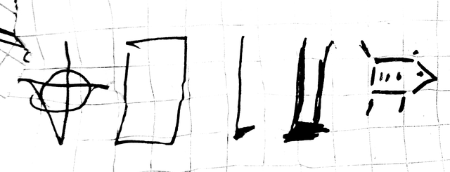

# Picilang (printable version)

The grammar is simple and there are no exceptions\*.

\*: with the only exceptions from the "no exception" rule being the way numbers are formed.

## Table of Contents <a id="toc" href="#toc">&#5130;</a> <a href="#top">&#5123;</a>

- [Alphabet and pronunciation](#abc)
- [Word structure](#ws)
  - [Compound words](#cw)
- [Parts of speech](#pos)
- [Word order](#wo)
- [Sentence types](#st)
  - [Declarative sentences](#ds)
  - [Interrogative sentences](#is)
  - [Imperative sentences](#ims)
- [naj, lo, ma, so and ka](#najlomasoka)
- [Numbers](#nu)
  - [General numbers](#gn)
  - [Precise numbers](#ps)
  - [Operations, expressions](#op)
- [Date and time](#dt)
- [Names](#nimi)
  - [Transliterating names](#tl)
- [Examples](#ex)
- [Unnecessary details](#ud)

## Alphabet and pronunciation <a id="abc" href="#abc">&#5130;</a> <a href="#top">&#5123;</a>

The alphabet has 12 letters, consisting of 3 vowels, 2 semi-vowels and 7 consonants.

Semi-vowels are considered as their own group, they cannot be substitutes of consonants or vowels!

The alphabet is `k, l, m, n, p, s, t, a, i, o, w, j`.

The sound of each letter is preferably the same as their IPA counterpart, but variations allowed (as long as each phoneme are clear-enough).

Nothing is capitalized by default, although the first word of a sentence can be capitalized, if it would take effort to make it not to do so (e.g. when typing on phone).

Foreign words and loanwords are always capitalized and transliterated.

The stress is on either the first syllable or, in case of compound words, on the first syllable of the root word which you want to emphasize. To visually represent stress or emphasis, you can use an acute accent on the stressed syllable's vowel  (`a => á, i => í, o => ó`).

## Word structure <a id="ws" href="#ws">&#5130;</a> <a href="#top">&#5123;</a>

Words are made out of CVs (consonant, vowel, optional semivowel) consonants, where `C = {k, l, m, n, p, s, t}; V = {a, i, o}; s = {w, y}`.

### Compound words <a id="cw" href="#cw">&#5130;</a> <a href="#top">&#5123;</a>

Compound words are hyphenated and for all intents and purposes are a single word. Two or more words of the same part of speech can be combined into compound words, but you cannot combine words of different part of speech! However, compound words are like any other word, so even though the roots (or the specific meanings used) must be the same part of speech, the compound word itself can be another part of speech (as a variant of the original meaning which retains the root words' part of speech).  
An example for a compound word is _ko-si_, which means "communication system" or "system of communication".  
Another example would be _ni-ki_, which is the 1st person plural pronoun ("we") that as a modifier means "our", "ours" or "our way". Same could be said all about all the other pronoun (including the ones that are not compound words).

The "main", "more significant" or "broader" root word should be the first one and "specifying" roots proceed them, but this is not a hard rule and most, if not all, compound words' roots can be moved around within the word to fit the intended meaning better or to emphasize one aspect of the meaning (e.g. `si-ko` would emphasize the systematic nature, while `ko-si` emphasizes the communication aspect).  
However, it is customary to place `naj`, `ma` and `lo` at the end of compound words, ta Kosapisota kiwti la.

## Parts of speech <a id="pos" href="#pos">&#5130;</a> <a href="#top">&#5123;</a>

Picilang has 5 parts of speech, _nouns, verbs, modifiers, conjunctions and prepositions_.

Most of these work mostly like in English and many other languages, but _modifiers_ can be parts either noun or verb phrases, so there are no separate adjectives and adverbs.

Foreign words can be any part of speech.

## Word order <a id="wo" href="#wo">&#5130;</a> <a href="#top">&#5123;</a>

The basic sentence structure is SVO (subject-verb-object), where the subject and object are always noun phrases, the predicate is always a verb phrase.  
Because the objects has to be noun phrases, sentences like "noun is adjective" are structured like "adjective noun is", e.g. _It is two._ would be _to na sa_ (literary "two it is"). "Noun is noun" sentences are not affected and the previous "noun is adjective" sentence can be phrased as "noun is 'an adjective one'" using the "blank noun" _li_, for example _na sa to li_ (it is two things) instead of _to na sa_.

Phrases are head-final (the modifiers precede the head). Modifier phrases are impossible.

Conjunctions are used to connect two phrases or sentences together. Joined sentences are separated by a comma.  
When multiple phrases are joined by conjunctions, the conjunction has to be said every time (e.g. `ni ko ti ko na`, not `ni, ti ko na`).

Prepositions are followed by noun phrases and are located at the end of sentences, and a comma may be used to separate them from the rest of the sentence.

## Sentence types <a id="st" href="#st">&#5130;</a> <a href="#top">&#5123;</a>

Regardless of its type, a sentence always have at least a subject and a verb, and use SVO word order.

Incomplete sentences are not allowed.

### Declarative sentences <a id="ds" href="#ds">&#5130;</a> <a href="#top">&#5123;</a>

Declarative sentences are the _default_, there is nothing special about them.

### Interrogative sentences <a id="is" href="#is">&#5130;</a> <a  href="#top">&#5123;</a>

Interrogative sentences, also knows as "questions", has three types that have different sentence structures. They all end with a question mark. These types and their structures are:

- **General or yes-no questions**: it has the same structure as declarative sentences
- **Special or kiw- questions**: these are the equivalent of English's _wh- questions_ and they contain one or more _question words_
- **Multiple choice questions**: somewhere in the sentence multiple choices are presented that are separated by `tajtaj` or `tajkotaj`; the former allows only one of the options to be correct, while the latter allows multiple choices (in other words, they work similarly to exclusive and inclusive or respectively)

The **question words** are `kiwno`, `kiwto`, `kiwmo`, `kiwko` and `kiwpi`, that ask about which and are used in place of a noun, verb, modifier, conjunction or preposition respectively.  
For certain questions (such as "why") a combination of a preposition or noun, and `kiwno` is used, such as `ta kiwno` means "why" and `nomi kiwmo` for "how many".

Answers can be formed multiple ways, depending on what kind of question was used. The possible formats are the following:

- "Yes" and "no"
  - using the words `lo`, `naj` or `so` as standalone verbs (meaning "yes" or "replying yes", "no" or "replying no", and "maybe" or "replying maybe" respectively), usually with the subject `li` (used as a general "placeholder" noun), `la` (this noun explicitly refers back to the question's subject or object, depending on context), `ni`, `ti` or `na` (these are the 1st, 2nd and 3rd person pronouns respectively)
  - using the word `naj` as a modifier before the question's object in a noun phrase, followed by `sa` (meaning "not object")
  - using the word `naj` as a modifier before the question's subject, followed by the question's verb (meaning "no")
    - Using `lo` and `so` this way will not result in a straight "yes" or "maybe" answer! In this context, they will use their regular meanings.
  - repeating the question's subject and verb, optionally followed by the object with or without modifiers to say "yes".
    - `naj` can be placed anywhere within the sentence to make it a "no" answer.
- kiw- answers follow the format _kiw sa X_, where X is the whole questioned phrase. All answers are considered nouns for the purpose of simplicity
  - In case of `kiwno`, the object is simply a noun (e.g. _kiw sa li_).
  - ~ `kiwto`, the object is a verb.
  - ~ `kiwmo`, the object is the questioned modifier followed by the noun from the question.
  - ~ `kiwko`, the object is the questioned conjunction surrounded by both phrases (with or without all of their modifiers, e.g. _kiw sa ni ko ti_ and _kiw sa mipi li taj na_).
  - ~ `kiwpi`, there is no object, but there is a full prepositional phrase at the end of the sentence (e.g. _kiw sa sipi ma_)
- choice questions are answered by repeating the choice (or choices separated by `ko`), or using `naj la`, `naj-la` (meaning "none of these"), `so la`, `so-la` (meaning "all of these") or `ka la`, `ka-la` (meaning "any of these") followed by `sa`, or saying `ni liw X` (meaning "I want X"), `la sa X`, `na sa X` (meaning "it is" or "they are") or repeating the statement with X only, where X is the choice or choices.

The phrase "question's subject" refers to the person or thing, might not literally be the same word; for example, when the question's subject is "you", the answer's subject will be "I".

#### Examples

**nomi kiwmo pi ti sa?** How many of you are there?  
_kiw sa ponati._ \[There are\] 314.

**Kosapisota tina kiti paw ko-si ta kiwno?** Why did I\* create Picilang?  
_kiw sa ta Kosapisota liw la_ Because I\* wanted to.

**ti sa lo kiwno?** Where are you from?  
_kiw sa lo ma Liwlopa._ \[I am\] from Europe.

**ni pi Mata tajtaj Pokasi ma sa?** Am I from Hungary or Bulgaria?  
_la pi Mata sa._ \[I am\] Hungarian. _ni pi Mata ma sa._ I am from Hungary.

**ti Pokasi tajtaj Mata sa?** Are you Bulgarian or Hungarian?
_la Pokasi sa._ \[You are\] Bulgarian. _ti Pokasi sa._ You are Bulgarian.

\*: Kosapisota is the transliteration of my name.

### Imperative and exclamatory sentences <a id="ims" href="#ims">&#5130;</a> <a href="#top">&#5123;</a>

Imperative (commands and wishes) and exclamatory sentences are structurally the same as declarative sentences, but they end with an exclamation mark.

## naj, lo, ma, so and ka <a id="najlomasoka" href="#najlomasoka">&#5130;</a> <a href="#top">&#5123;</a>

The words `naj`, `lo`, `ma`, `so` and `ka` are special in that they can be part of any compound word, but they normally cannot be used alone, except when they are used as numbers, or when they are part of a noun phrase and are used as modifiers.

`naj` and `lo` also can be used as regular verbs for answering questions.

## Numbers <a id="nu" href="#nu">&#5130;</a> <a href="#top">&#5123;</a>

Picilang has two separate number systems, one for general everyday use and one to express precise numbers in base 10.

Numbers should precede all the other modifiers in noun phrases.

### Imprecise/general numbers <a id="gn" href="#gn">&#5130;</a> <a href="#top">&#5123;</a>

These are always used as modifiers and can only be used in noun phrases.

The general system consists of 4 words that are `naj`, `lo`, `ki` and `moti` meaning "zero", "one", "many" and "unreasonable amount/number".

To express general numbers as nouns, you can always use `noj` (meaning "unit") or `li` (meaning "thing"), or `la`, if you refer back to a previously mentioned thing.

### Precise numbers <a id="ps" href="#ps">&#5130;</a> <a href="#top">&#5123;</a>

Precise numbers can be used as modifiers in noun phrases (as long as they are integers) or, alternatively, you can form a phrase meaning "X number of units of noun", "Y fractions of noun" or "X number and Y fractions of noun" using the nouns `noj` and `ta` to express units (whole numbers) and fractions respectively, `pi` to express "over" and `ko` between the units and fractions. This latter form is called _long number expression_.  
If you only need to express a number, you can use `ta` in addition to the nouns listed under _general numbers_.

Even though technically all numbers are compound words consisting multiple modifiers, the actual digits are treated and written as a simple modifier.

To use precise numbers, you can use the words from 0 to 9 and simply read out the number from lowest to highest decimal places (or "right to left"). These numbers are:

| Word | Number |
|------|--------|
| naj  | zero   |
| na   | one    |
| to   | two    |
| ti   | three  |
| po   | four   |
| pa   | five   |
| si   | six    |
| siw  | seven  |
| tij  | eight  |
| no   | nine   |

_Negatives_ are formed by forming a compound modifier ending in `naj` (effectively adding a 0 to the highest decimal place). Negatives can be used on both units and fractions. In both cases they effectively move the number towards the left on the number line.  
Similar to how negative numbers are formed, `ka` can be used to say _absolute values_, where the number can be either positive or negative. This feature is practically useless in real life.

You can also express fractions (meaning literal fractions, "one third" and alike) by using long number expressions (whose value will be the numerator) and a simple integer as a modifier on the noun (that will be the denominator). Only fractions that has an integer denominator can be said this way, but there is no such restriction for the numerator. These parts are separated by `pi`.

### Operations and expressions <a id="op" href="#op">&#5130;</a> <a href="#top">&#5123;</a>

Picilang is not (yet?) designed to be able to express mathematical expressions accurately, however, there are some ways to express some of them. `ko` can be used to express addition, in basically the same as the _long number form_. As its counterpart, `ko-naj` can be used to express subtraction.

### Examples

- **14**: _pona_
- **-42**: _poto-naj_
- **-3.14**: _ti-naj noj ko pona-naj ta_ (-3 times 1 and -14 times 0.1) or _po-naj noj ko sitij ta_ (-4 \* 1 + 86 \* 0.1)
- **69.96**: _nosi noj ko sino ta_
- **1995**: _panonona_
- **1/4**: _na noj pi po NO_ (one quarter NOUN, lit. one unit of four noun)
- **9/2 things**: _no noj pi ko li_ (nine halves things, lit. nine unit of two things)
- **|914| or abs(914)**: _ponano-ka_

## Date and time <a id="dt" href="#dt">&#5130;</a> <a href="#top">&#5123;</a>

Dates (`tati`) and time (`tajmi`) are expressed the same way. You can also refer to date and time collectively as `tatitajmi`.

Date and time are written according to ISO 8601, using the following format (`YYYY-MM-DD HH:MM:SS`). One cannot specify timezone, but can express "my time", "your time" (_tajmi pi ni_ and _tajmi pi ti_ respectively) and "UTC" (_mi-tajmi_)
Time can be expressed using a rather long phrase, so try to avoid using it, if possible.

The words for "year (CE)", "year (BCE)", "month", ... and "seconds" are all nouns, connected by `ko`. Fractions of these can also be expressed using long number expressions. For a quick example, the current time (as of writing the first version of this paragraph) is:

_2021-06-05 14:41:20_
tatitajmi pi ni sa natonajto mi-koti ko si kona ko pa napi ko pona lola ko napo pili ko najto siko.

another example would be:

_The time of finishing the this sentence is 15:11. Date's the same._  
tajmi pi pini pi lisa na sa pana lola ko nana pili. tinilo tati sa.

Fractions of times look like this:

_1.5 days_  
na noj ko pa ta pi napi

_2 seconds and 587 milliseconds_  
to noj ko siwtijpa ta pi siko

## Names and foreign words <a id="nimi" href="#nimi">&#5130;</a> <a href="#top">&#5123;</a>

All names and foreign words must be valid Picilang words according to previous rules, although capitalized.

The name order follows the Eastern name order, meaning that the surname preceded the given name(s).

### Transliterating into Picilang <a id="tl" href="#tl">&#5130;</a> <a href="#top">&#5123;</a>

- Standard rules apply, including the name order.
- Consonant and vowel clusters has to be broken down.
- The syllable count must remain the same.
- When a word begins with a vowel, the transliterated word's first consonant should be used in place of the missing vowel, or the removed consonant, if it had a consonant cluster.
- Transliterated names always begin with a capital letter.
- Initials in names should become a single syllable.
- Use semi-vowels as they feel right, but keep in mind, that they cannot be used as consonants!
  - However, they can be used in place of consonants
- Names and titles can be merged into one word when transliterated and this "work around" some of the restrictions.
- For deciding what letter to you for sounds that aren't present in Picilang, you can use the following _professional_ tables:

These categories are only a recommendation that makes sense to me, not an official rule.

Examples:

- Internet &gt; _Nitini_
- Github &gt; _Kito_
- B. Zoltan Gorza &gt; _Kosa Pi Sota, Kosapisota_
- névtelen &gt; _Niwtilin_
- Anon &gt; _Nano_
- Mass Effect &gt; _Masipi, Ma Pipi_
- Linux &gt; _Lino_
- Audacity &gt; _Tawtasiti_

## Examples <a id="ex" href="#ex">&#5130;</a> <a href="#top">&#5123;</a>

### Baby In A Backpack by Dan Bull (excerpt)

| English                                     | Picilang                          |  |
|---------------------------------------------|-----------------------------------|--|
| Give me your hand in panic                  | ti kata ti kana lo pani          | you give your hand in fear  |
| Give me your hand in haste                  | ti kata ti kana lo sani          | you give your hand in haste |
| I know you can handle yourself              | ni sona to ti kato to loti ti-tinilo | I know that you can to handle yourself |
| But damn it, just give me your hand in case | ti-paki ti kata ti kana lo ka-koto-litilo | but you give your hand in case\* |

The "me" in "give me" is omitted, since it would be obvious in context.

\*: literally "in a bad anticipated event"

## Unnecessary detail <a id="ud" href="#ud">&#5130;</a> <a href="#top">&#5123;</a>

The followings are not required for everyday usage or to understand the language, but offer insights and allow me to write down unnecessary details and/or irrelevant anecdotes.  
Because of the nature of these entries, many of them are written using a more regular language.  
Also, if you made it this far, I will presume that you are familiar with the general grammar and the dictionary, so translations might not be always provided.

This section has its own table of content to keep the main part of this doc cleaner and more easily accessible.

### Table of Contents <a id="toc2" href="#toc2">&#5130;</a> <a href="#top">&#5123;</a>

- [ko-si and the origin of the language](#ko-si)
- [Fictional origin](#fiction)
- [Yes, no, maybe?](#yesnomaybe)
- [Digits in reverse order](#digits)

### ko-si and the origin of this language <a id="ko-si" href="#ko-si">&#5130;</a> <a href="#top">&#5123;</a>

`ko-si` means "language" and so much more. Picilang's native name is `kiti paw ko-si`, which means "small language". But if `ko-si` means "language", then why is there two more words in `kiti paw ko-si`?

`ko-si` is a compound word made out of `si` (system) and `ko` (communication), hence the meaning "communication system". A language is a system of communication alright, and it can be written only or verbal only without a writing system. `paw` is defined as "auditory; audible; verbal", hence `paw ko-si` means "verbal communication system", i.e. a spoken language.  
What is or is not a language is a question for philosophers and linguists, and I am neither of those. `kiti paw ko-si` could have been easily called `kiti ko-si`, had I not intended to create another language only days prior beginning work on this one, that would had been a non-verbal language.  
Calling it `kiti paw ko-si` has a promise to it; this is a language intended to be used by humans or rather, it is possible to be used for verbal communication. Or something like that. I was very tired when I wrote my initial draft and I haven't thought about the later implications of the name, only that `ko-si` does not exclusively mean "language", so I created the `aw` modifier to specify the meaning. As you might have noticed, `aw` is not `paw`; it was about 10 minutes before I finalized the syllable structure and changed it to the latter.

When I came up with the native name of the language, it already had a name: Picilang /pi.t͡si.läŋɡ/. This name is a combination of the Hungarian word "pici" (meaning "small") and "lang", which is the shortening of "language". It was before the alphabet was finalized or even existed in any shape or form, only the very general concept existed for it, which was _create a simple language that is able to express things more specifically than toki pona and can be easily understood knowing only a handful of rules and using a dictionary_. This lead me to an idea of having only 4 parts of speech, SVO word order, having no cases, no suffixes and no inflections, making it a highly analytic language (the other main key features are detailed on the Home page or in the README---depending on where you read this).  
It quickly became apparent that I will not have a comfortably small vocabulary, thus I decided to create an app written in JavaScript to have easy access to the dictionary that is able to search in it and be usable on the go. This website was a natural progression from there and I am quite proud of the result; it's clean, easy to read and easy to use, while not being overly heavy on resources, even though my code is far from perfect or optimal for that matter.  
At the end of the day, it works and makes me happy---and isn't this what matter most?

PS: I have almost forgotten one important thing; `kiti paw ko-si` is easy to remember as "kitty paw cozy". This was not intentional, `si` comes from "system", `ko` is from "communication" and `kiti` is from `kicsi`, another Hungarian word for "small". `aw` was supposed to be from `auditory`, but since that is not valid, I arbitrarily threw a `p` to it and only then realized that it looks like `kitty paw`. I like cats, so it remained, even though I'm not 100% pleased with how that 'p' sounds in this phrase.

### Fictional (a.k.a. _truer_) origin <a id="fiction" href="#fiction">&#5130;</a> <a href="#top">&#5123;</a>

_kiti paw ko-si... Picilang... na ko-si... Pitila..._ A language that both exists, and nobody knows or understands. During my research I have come across it multiple times at different places, yet I cannot find a connection between them. It had been seen on the walls of ancient ruins, referenced in holy books and used in video games; this language did and do appear sporadically over thousands of years, possibly predating humanity as we know it.  
Its true origin, however, is unknown; it is, without a doubt, a product of intelligent design, but whose intelligence is responsible to create something this simple, yet so precise?

Yesterday I shared my findings with a fellow researcher, who specializes in linguistic anomalies. A wise man of great disregard by the name of _Paz Imaginaria_, she told me that she had not only saw it before, but had been studying it for a while herself and collected every known and not yet confirmed sightings and references of it. According to her, there are written samples using not less than 73 different writing systems and those are only the ones we are able decipher; however, strange series of symbols had also been found in northern Africa -- predating the Mesopotamian cuneiform by at least 5300 years and the earliest known proto-writings by more than 1000 years -- that are theorized to be some sort of logographic script. By the nature of the script, it is currently impossible to determine in which language this is written. All we know about it is that it had been carved into hard rock using a sharp, presumably metal instrument, given that we can see marks of the point bending and bluntening before it was either replaced or sharpened. This writing consists of a total of 148 symbols, only 5 of them are repeating, the other 133 symbols are unique.

Prior studies, which predate the discovery of _Pitila_, concluded that it contains agricultural instructions, mostly likely about how to grow crops and breed aurochs, although all of this is only speculation based on the appearances of individual symbols. The validity of these hypotheses would be questionable, did we know more. Alas, we do not. Regardless of how little we do know, philologists are adamant and refuse the possibility of it being "anything more than a sample of an early, currently unknown civilization's first attempt of preserving ideas in written form." Professor Imaginaria, _the greatest young talent on the fields of philology and linguistics_ as she used to be called contested this idea in a book titled "Everything We Know About The Northafc Script Is Wrong And Here's Why", in which she presented all the facts, leading hypotheses and their disproofs through 676 pages. As one can imagine, this did not please her colleges. In this book she presented some of her ideas based on findings of hers and other's, that many mistook as serious theories and attacked them accordingly, causing Imaginaria's sudden downfall from the academic Olympus.

There is a real possibility that the both of us might be able to crack this mystery once and for all. Our initial meeting ended with agreeing upon a later date on which we begin to compile all known text and "normalize" the data, meaning transcribing them into a fitting writing system to make it easier to work with and mark all the _problematic_ samples, where we mark all the hardly legible and illegible text, substitute our own words that we might think would fit and try to account for errors on the original writer's part that may occur during copying, misspelling, etc. After we finish the initial groundwork, we plan to feed the data to an AI, that hopefully will find something we either cannot or could not without manually going through the then-completed corpus and cross-referencing everything. It is going to be a long and resource-intensive process that we cannot hope to finish in our life time. Alas, I am optimistic and I shall continue documenting our findings and hope for the best.

At this point... 5 years... Watson found a correlation between... _They_ brought... Orion... Paz has been... Finnish rebels... was _Them_ all... days are counted... hiding... tomorrow... Day 511: Watson did it! The meaning suggest... If I don't make it... _They_... I... dead... all lost.

### Yes, no, maybe? <a id="yesnomaybe" href="#yesnomaybe">&#5130;</a> <a href="#top">&#5123;</a>

I would like to be the first to say that yes, the way you answer questions is possibly (probably) overcomplicated, but let me offer you another way to look at it: you can choose how to answer based on your preference. Moreover, they have slightly different meaning or connotations. Here is a table for all\* the available combinations, their meanings and their connotations (as I interpret them; `~` means that this is the same as the one above) in the same order as they are described under [interrogative sentences](#is) answering the question _ti kiwti na kiti ko-si?_ (do you like this small language?):

| Phrase                     | (Semi-literal) meaning                 | Connotation                                                                                                                                                                                  |
|----------------------------|----------------------------------------|----------------------------------------------------------------------------------------------------------------------------------------------------------------------------------------------|
| li lo                      | It's a yes.                            | Possibly dismissive, grammatically correct, but you might not understand or comprehend the question well enough and don't know which noun should be used.                                    |
| li naj                     | It's a no.                             | ~                                                                                                                                                                                            |
| li so                      | It's a maybe. It's an either.          | ~                                                                                                                                                                                            |
| la lo                      | It's a yes. X say(s) "yes"             | Directly refers back to question's subject or object, regardless of whether it's a person or an object.                                                                                      |
| la naj                     | It's a no. X say(s) "no"               | ~                                                                                                                                                                                            |
| la so                      | It's a maybe. X say(s) "maybe/either". | ~                                                                                                                                                                                            |
| ni lo                      | I reply "yes".                         | Can be used generally, not only when the question begins with "do you..." Gives a bit of personal flavor.                                                                                    |
| ni naj                     | I reply "no".                          | ~                                                                                                                                                                                            |
| ni so                      | I reply "maybe".                       | ~                                                                                                                                                                                            |
| ti lo                      | You reply "yes".                       | ~                                                                                                                                                                                            |
| ti naj                     | You reply "no".                        | ~                                                                                                                                                                                            |
| ti so                      | You reply "maybe".                     | ~                                                                                                                                                                                            |
| na lo                      | X replies "yes".                       | ~                                                                                                                                                                                            |
| na naj                     | X replies "no".                        | ~                                                                                                                                                                                            |
| na so                      | X replies "maybe".                     | ~                                                                                                                                                                                            |
| lo na kiti ko-si sa        | Only that small language is.           | Not a straight up "yes"---it can work, but eliminates all other possibilities (e.g. when something else might also be true).                                                                 |
| lo la            sa        | Only that is. Only I am.               | ~, "la" can be either question's subject or object (depending on context).                                                                                                                   |
| naj na ko-si     sa        | Not that language.                     | Works as a general "no", can be considered as more precise or "official".                                                                                                                    |
| naj la           sa        | Not that.                              | ~,  "la" can be either question's subject or object (depending on context). When "la" is a subject, then it might be considered defensive.                                                   |
| so ko-si         sa        | Every language is.                     | It's neither an obvious "no" or a "yes", and arguably not an answer either, unless you deliberately want to say "every X is".                                                                |
| so la            sa        | Every "that" is.                       | ~, "la" can be either question's subject or object (depending on context).                                                                                                                   |
| lo ni sa                   | Only I am.                             | Works only under specific circumstances.                                                                                                                                                     |
| naj ni sa                  | Not me.                                | It works, although one might interpret is as being defensive.                                                                                                                                |
| so ni sa                   | Every me is.                           | Works only under specific circumstances and not with all nouns .                                                                                                                             |
| ni kiwti                   | I like.                                | General "yes".                                                                                                                                                                               |
| ni kiwti-naj               | I like not.                            | General "no".                                                                                                                                                                                |
| naj ni kiwti               | Not I like.                            | No, with emphasizing that it's not me, who likes it.                                                                                                                                         |
| ni-naj kiwti               | Not I like.                            | ~                                                                                                                                                                                            |
| ni kiwti na kiti ko-si     | I like this small language.            | Very precise, possibly overly so.                                                                                                                                                            |
| ni kiwti na-naj kiti ko-si | I don't like *this* language.          | Very precisely saying that I don't like this particular language.                                                                                                                            |
| ni kiwti la                | I like it.                             | Simple, elegant, polite, yet short and on the point.                                                                                                                                         |
| ni kiwti la-naj            | I like not it.                         | ~                                                                                                                                                                                            |
| ni kiwti naj la            | I like not it.                         | ~                                                                                                                                                                                            |
| ni kiwti-naj la            | I don't like it.                       | Can be the same as _ni kiwti-naj_ without the object, but this may include that you have a different opinion/feeling about it.                                                               |
| la kiwti                   | (in this case I) like.                 | Same as with _ni_ in this case. Similar can be said about all of the above examples beginning from _ni kiwti_ (where the object wasn't replaced with "la"), only using "la" instead of "ni". |

_X_ denotes "3rd person subject".  
When the full object is repeated, the modifiers can be dropped.

\*: after the standard ni/ti/na lo/naj/so answers, only the logical "ni" subject is used. In many other use cases (i.e. when the subject is in 3rd person), "la" is the easiest logical subject to use, although "la" is not limited to 3rd person. Some of the "no" answers from the last category are also missing due to not wanting to write about 10 "yes" and 20 "no" versions of it.

### Digits in reverse order <a id="digits" href="#digits">&#5130;</a> <a href="#top">&#5123;</a>

In contrast of the initial goal of creating a _simple_ language, there are some interesting oddities throughout, like the fact that in numbers, the order in which the digits are read is reversed, it's right-to-left. This is a result of a deliberate choice followed by an simple error that made the numbers better sounding. Let me explain.

Before `so` and `ka` was created, only `naj`, `lo` and `ma` existed. It was already decided that `naj` (originating from English _nay_) is going to be the word for number 0 and `ma`'s definition seemingly fitted the need for a word to use for negative numbers. At this point I only had the very first outlines of how I wanted numbers to be expressed, the _general_ and _precise_ split have already happened and both sections had about 2 sentences each. I quickly noted that `ma` would be used for negatives, then wrote the _general numbers_ section; that would be used more often, after all. Then it was time to write the precise numbers, I have already <s>stolen</s> gotten inspired by English numbers, wrote the table for them, and began writing how to form negatives and read back the sentence, when I realized that I had made an error; I accidentally wrote `naj` instead of `ma`. Naturally, I quickly fixed it, read it again and... it didn't sound good. It was not bad or anything, I just didn't like it as much as with `naj`. After consulting the dictionary and the already written grammar (including reading the digits in reverse order that was still not finalized then), I have decided that `naj` could work and it actually reinforces the idea of reversing the digits; adding a 0 to the "end" of the number would change the magnitude, but adding a 0 to the highest decimal place would change nothing.  
This is why the _lowest to highest decimal place_ order was finalized, but how did it even occur to use this system?

When I was learning accounting on university (it was an obligatory introductory course), we were taught to write number right-to-left, so that the decimal places would match in each row; in other words, we were emulating using a monospaced font in handwriting (insert 10 minutes rant of having to do accounting on paper while I was on an IT program). This allowed to see orders of magnitude differences very easily and clarity is always welcomed, especially when it does not require too much effort. I wrote down the number from 0 to 6 when I decided to use this reverse order, all the numbers were one syllable, so order of magnitude difference would be obvious; then I continued writing down the numbers and 9 proved to be difficult. See, "nine" would transliterate to either "naj" or "na" naturally, both of which were already used. It took a total of 3 minutes of thinking to come up with `no`, based on how Cockney accent sound to a Hungarian. Admittedly, this is not a good reasoning for why it is `no`, but it couldn't had been `ki` or `li` (both based on Hungarian "kilenc").  
_It's all nice and all, but still, why the reverse order? Numbers are already monosyllabic!_ Reading out digits in sequence is nothing usual, the problem is the opposite: it is too common. Even after elementary/primary school, you read out numbers digit-by-digit subconsciously, then you take the whole sequence and interpret it. This is so commonplace that I feel like it does not convey enough sense of magnitude. Just say "one zero zero zero zero"---does it feel like a "big" number compared to "one zero zero"? Try reversing the order, "zero zero zero zero one" feels bigger and longer, it is not just a meaningless repetition of "zero", but it's a promise, that at the end, there is going to be a non-zero value, the question is, when? Now compare this to "zero zero one", which now feels like a teeny-tiny number compared to 10000, which it arguably is.  
Full disclosure, I am not a psychologist, nor a psychiatrist, so I don't know the exact details how the brain processes numbers. I might be completely wrong, it might not be the same for you, but it makes sense for _me_ and, at the end of the day, that's what matters for _me_ when _I_ create a language.

**tl;dr** It's easier to spot different orders of magnitudes.
