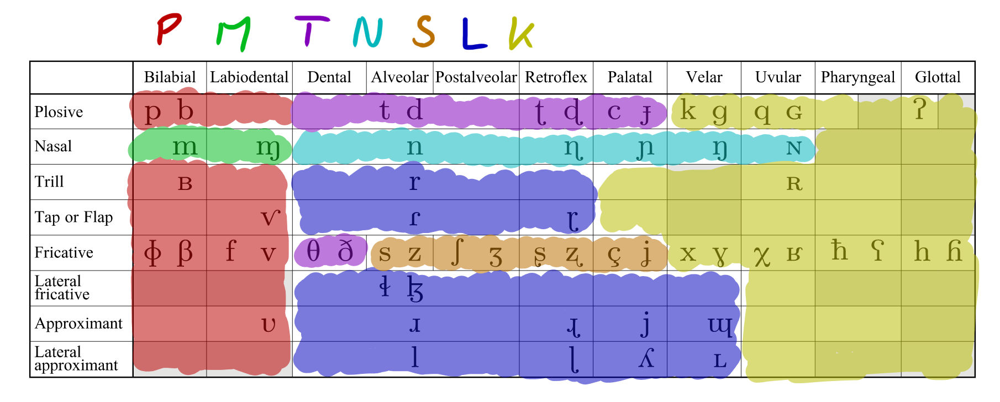
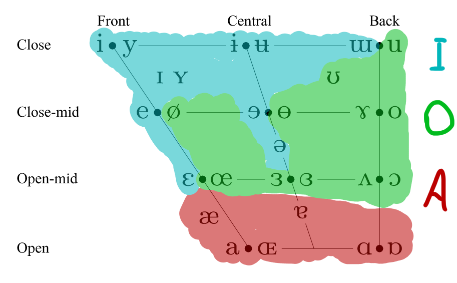

# Picilang

## Grammar

The grammar is simple and there are (almost) no exceptions\*.

\*: with the only exceptions from the "no exception" rule being the letter `y` and the way numbers are formed.

### Alphabet and pronunciation

The alphabet has 12 letters, consisting of 3 vowels, 2 semi-vowels and 7 consonants.

Semi-vowels are considered as their own group, they cannot be substitutes of consonants or vowels!

The alphabet is `k, l, m, n, p, s, t, a, i, o, w, y`.

The sound of each letter is the same as their sound in IPA, with the only exception being the letter `y`, which denotes the `/j/` sound.

Nothing is capitalized by default, although the first word of a sentence can be capitalized, if it would take effort to make it not so (e.g. when typing on phone).

Transliterated/foreign/loanwords are always capitalized.

The stress is on either the first syllable or, in case of compound words, on the first syllable of the root word which you want to emphasize. To visually represent stress or emphasis, you can use an accute accent on the stressed syllable's vowel  (`a => á, i => í, o => ó`).

### Word structure

Words are made out of CVs (consonant, vowel, optional semivowel) consonants, where `C = {k, l, m, n, p, s, t}; V = {a, i, o}; s = {w, y}`.

#### Compound words

Compound words are hyphenated and for all intents and purposes are a single word. Two or more words of the same part of speech can be combined into compound words, but you cannot combine words of different part of speech! An example for a compound word is _ko-si_, which means "communication system" or "system of communication".

The "main", "more significant" or "broader" root word should be the last one and "specifying" roots precede them, for example in _ko-si_, "si" means "system" and "ko" means "communication".  
However, it is customary to place `nay`, `ma` and `lo` at the end of compound words, ta Kosapisota kiwti la.

### Word order

The basic sentence structure is SVO (subject-verb-object), where the subject and object are always noun phrases, the predicate is always a verb phrase.

Phrases are head-final (the modifiers precede the head). Modifier phrases are impossible.

Conjunctions are used to connect two phrases or sentences together. Joined sentences are separated by a comma.

Prepositions are followed by noun phrases and are located at the end of sentences.

### Numbers

Picilang has two separate number systems, one for general everyday use and one to express precise numbers in base 10.

Numbers should precede all the other modifiers in noun phrases.

#### Imprecise/general numbers

These are always used as modifiers and can only be used in noun phrases.

The general system consists of 4 words that are `nay`, `lo`, `ki` and `muti` meaning "zero", "one", "many" and "unreasonable amount/number".

#### Precise numbers

Precise numbers can be used as modifiers in noun phrases (as long as they are integers) or, alternatively, you can form a phrase meaning "X number of units of noun", "Y fractions of noun" or "X number and Y fractions of noun" using the nouns `noy` and `ta` to express units (whole numbers) and fractions respectively, `pi` to express "number of" and `ko` between the units and fractions.

Even though technically all numbers are compound words consisting multiple modifiers, the actual digits are treated and written as a simple modifier.

To use precise numbers, you can use the words from 0 to 9 and simply read out the number from lowest to highest decimal places (or "right to left"). These numbers are:

| Word | Number |
|------|--------|
| nay  | zero   |
| na   | one    |
| to   | two    |
| ti   | three  |
| po   | four   |
| pa   | five   |
| si   | six    |
| siw  | seven  |
| tiy  | eight  |
| no   | nine   |

Negatives are formed by forming a compound modifier ending in `nay` (effectively adding a 0 to the highest decimal place). Negatives can be used on both units and fractions. In both cases they effectively move the number towards the left on the number line.

#### Examples

- **14**: _napo_
- **-42**: _poto-nay_
- **-3.14**: _ti-nay noy ko pona-nay ta_ (-3 times 1 and -14 times 0.1) or _po-nay noy ko sitiy ta_ (-4 \* 1 + 86 \* 0.1)
- **69.96**: _nosi noy ko sino ta_

### Names

Names must be valid words according to previous rules. The name order follows the Eastern name order, meaning that the surname preceded the given name(s).

#### Transliterating into Picilang

- Standard rules apply, including the name order.
- Consonant and vowel clusters has to be broken down.
- The syllable count must remain the same.
- When a word begins with a vowel, the transliterated word's first consonant should be used in place of the missing vowel, or the removed consonant, if it had a consonant cluster.
- Transliterated names always begin with a capital letter.
- Initials in names should become a single syllable.
- Use semi-vowels as they feel right, but keep in mind, that they cannot be used as consonants!
  - However, they can be used in place of consonants
- Names and titles can be merged into one word when transliterated and this "work around" some of the restrictions.
- For deciding what letter to you for sounds that aren't present in Picilang, you can use the following _professional_ tables:

These categories are only a recommendation that makes sense to me, not an official rule.

Examples:

- Internet &gt; Nitini
- Github &gt; Kito
- B. Zoltan Gorza &gt; Kosa Pi Sota, Kosapisota
- névtelen &gt; Niwtilin
- Anon &gt; Nano
- Mass Effect &gt; Masipi, Ma Pipi
- Linux &gt; Lino
- Audacity &gt; Tawtasiti
